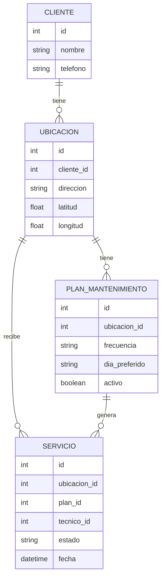

<div align="center">
<h1>Trabajo Integrador Final</h1>


</div>

<br><br>

**Grupo**: 163

**Integrantes**:

- Tomás José Buforn,
- Maximiliano Rao,
- Eric Suarez Dubs

<br>

---


## Definición Refinada del Problema

El caso está inspirado en un negocio real de mantenimiento de piscinas observado informalmente por el equipo, sin que se haya realizado una entrevista formal con el dueño. La planificación de turnos se realiza mediante planillas de Excel y la comunicación con el personal de campo mediante WhatsApp.

A partir de esa observación informal, el equipo asume como hipótesis de trabajo que la planificación diaria insume aproximadamente 4 horas, y que el retrabajo generado por cambios de último momento agrega entre 2 y 3 horas adicionales. Estos valores no provienen de una medición ni de una entrevista con el propietario: son una estimación del equipo a partir de lo observado, y se tratarán como una hipótesis a validar (o descartar) durante el proyecto, no como un dato confirmado del problema.

Esta desconexión de la información puede generar retrabajo ante cambios de último momento, dificultades para conocer de manera actualizada el estado de los servicios y posibles demoras en la coordinación con los técnicos y la atención al cliente. Estas consecuencias deberán ser validadas mediante la observación y medición del proceso actual. Como hipotesis de solución, una plataforma centralizada podría permitir gestionar la agenda, automatizar la asignación de rutas y registrar el estado de los servicios en una única plataforma accesible desde cualquier dispositivo.

### Identificación de Actores y Necesidades

- Dueño/Administrador: Necesita optimizar los tiempos de planificación, reducir errores de asignación y tener una visión global de la operación diaria.
- Personal de Campo (Técnicos): Necesitan visualizar su agenda y los servicios asignados de manera actualizada, recibir notificaciones sobre cambios sin depender de mensajes manuales y poder reportar la finalización de tareas desde el teléfono.
- Clientes: Necesitan previsibilidad sobre cuándo será visitado su domicilio y recibir constancia del servicio realizado.

### Análisis del Flujo de Trabajo

- Estado Actual: El dueño revisa pedidos → Carga manualmente en Excel → Diseña la ruta a criterio propio → Envía capturas/mensajes por WhatsApp → Si hay un cambio, debe contactar a cada técnico individualmente y actualizar el Excel.

- Impacto de la Ineficiencia: La información, al estar distribuida entre diferentes medios, podría limitar potencialmente la capacidad de la empresa para aumentar la cantidad de servicios sin incrementar proporcionalmente el esfuerzo administrativo. Esta relación deberá ser validada mediante la medición del tiempo destinado a tareas de planificación y coordinación antes y durante una eventual prueba piloto.


### Propuesta de Valor Agregado
La solución propuesta no solo "digitalizaría" el Excel, sino que transformaría el proceso porque:
- Optimización de recorridos: La optimización del orden de los servicios busca reducir los tiempos de traslado y el tiempo entre servicios, así como el consumo de combustible.
-Facilita la reprogramación: Ante una modificación o demora, el administrador podrá modificar manualmente la asignación o el horario de un servicio desde la plataforma. El cambio quedará reflejado en la agenda correspondiente, evitando tener que actualizar diferentes medios de comunicación de manera independiente.
- Mejora la experiencia: El técnico trabaja con una herramienta profesional y el dueño recupera tiempo para tareas estratégicas


### Preguntas de Validación
¿Cuánto tiempo se pierde actualmente en "retrabajo" por cambios de turnos? 

> Esta cifra es una estimación del equipo, construida a partir de la observación informal del negocio de referencia — no surge de una entrevista ni de una medición sistemática. Se estima en 4 horas diarias de planificación inicial, más entre 2 y 3 horas adicionales de retrabajo por cancelaciones, reorganización de servicios y comunicación de cambios vía WhatsApp. Al no contar con acceso directo a la empresa, este valor se mantiene como hipótesis de partida y no podrá contrastarse con un baseline real durante este proyecto; se documentará explícitamente esta limitación.

¿Por qué un calendario compartido de Google o Excel online no es suficiente para este caso específico? 

> No se parte de la premisa de que herramientas como Excel Online o Google Calendar sean insuficientes en términos generales. De hecho, podrían utilizarse para mejorar parcialmente el proceso actual. La diferencia que se busca evaluar es si una solución específica para la empresa puede integrar en un mismo flujo las operaciones que actualmente se realizan mediante distintas herramientas.
En el proceso actual, la planificación, la comunicación de modificaciones y el seguimiento del estado de los servicios se realizan mediante herramientas separadas. Esto obliga al administrador a mantener y actualizar información en diferentes medios y a comunicar manualmente determinados cambios. Una solución específica podría centralizar estas operaciones y adaptar la interfaz a las necesidades de cada actor. Por ejemplo, el administrador podría gestionar la agenda y las asignaciones desde una única plataforma, mientras que el técnico podría consultar sus servicios y actualizar su estado desde el teléfono sin necesidad de modificar planillas o depender exclusivamente de mensajes.
El valor agregado del desarrollo a medida no se considerará demostrado de antemano. Será una hipótesis a validar durante el proyecto, comparando el proceso actual con el funcionamiento del MVP mediante métricas de tiempo, cantidad de modificaciones comunicadas manualmente, errores de coordinación y adopción por parte de los usuarios.

<br>

---


## Definición del stack tecnológico

- **Frontend: React + TypeScript** para una aplicación web responsiva con los tecnicos utilizandola en el telefono y el dueño de la empresa principalmente en pc. React permite construir una interfaz adaptable a diferentes dispositivos, mientras que TypeScript aporta tipado estático, ayudando a detectar errores durante el desarrollo y facilitando el mantenimiento del código a medida que aumenta la complejidad del sistema.

- **Backend: Node.js + Express + TypeScript** El equipo utilizará TypeScript tanto en frontend como en backend, reduciendo la diversidad tecnológica y facilitando el intercambio de conocimientos y estructuras entre ambas capas. Node.js dispone de un ecosistema maduro para el desarrollo de APIs HTTP, y se elige principalmente por la simplicidad para un equipo que ya conoce JavaScript, la facilidad de mantenimiento y no por requerimientos de alta concurrencia, que no son relevantes para el tamaño de esta empresa.

- **Base de Datos: PostgreSQL (Relacional)** Al manejar clientes, técnicos, turnos y rutas, los datos tienen una estructura clara y relaciones importantes que requieren integridad transaccional.

- **Despliegue: Contenedores (Docker)** en una PaaS (Plataforma como Servicio). Docker asegura que la aplicación funcione igual en desarrollo y producción, mientras que una PaaS reduce la complejidad operativa inicial.

**Experiencia real de cada integrante con las tecnologías propuestas:**

| Tecnología | Experiencia previa |
|---|---|
| TypeScript | Los 3 integrantes |
| React | Ninguno |
| Node.js / Express | Ninguno |
| Docker | 1 de 3 integrantes |

### Justificación de la elección

La elección del stack se fundamenta tanto en las características del problema como en los conocimientos actuales del equipo.

-Naturaleza del problema: El sistema necesita realizar principalmente operaciones de consulta y modificación de datos, como crear servicios, consultar agendas, actualizar estados y registrar información. Node.js y Express resultan adecuados para desarrollar una API web para este tipo de operaciones.

-Conocimientos previos del equipo: El equipo posee conocimientos previos de JavaScript, lo que representa una ventaja para trabajar tanto en frontend como en backend. Sin embargo, se reconoce que conocer JavaScript no implica dominar React, TypeScript, Node.js, Express, autenticación, Docker o despliegue. Por este motivo, la elección del stack deberá ser validada técnicamente durante los primeros sprints.

-Simplicidad: Se busca utilizar una arquitectura monolítica basada en PostgreSQL, Express, React y Node.js (PERN), evitando incorporar microservicios u otras tecnologías que no sean necesarias para resolver el problema planteado.

La elección definitiva se considerará viable si durante el Sprint 1 el equipo logra implementar correctamente una API básica, conexión con PostgreSQL, autenticación y ejecución del proyecto mediante Docker.


### Viabilidad y evolución

El sistema será diseñado inicialmente para las necesidades de una empresa de mantenimiento de piscinas de pequeña escala, priorizando la correcta resolución del problema operativo identificado por sobre la capacidad de soportar grandes volúmenes de usuarios.

PostgreSQL permitirá mantener la integridad de los datos relacionados con clientes, técnicos y servicios, mientras que Docker facilitará la reproducción del entorno y el despliegue de la aplicación.

El objetivo del MVP no es resolver escenarios de alta concurrencia ni grandes volúmenes de usuarios, sino comprobar que la solución resuelve adecuadamente el problema operativo de la empresa.

Si posteriormente la cantidad de usuarios o servicios aumentara significativamente, sería necesario analizar métricas de rendimiento y evaluar estrategias específicas de escalamiento. Docker facilitará la reproducción y el despliegue de los componentes, pero su utilización por sí sola no garantiza el escalamiento horizontal del sistema.

### Escala esperada del sistema

Dado que el equipo no cuenta con acceso a la empresa real, se asume como escenario de trabajo una pyme con aproximadamente 5 técnicos y 20 servicios diarios. Este valor es un supuesto del equipo, no un dato relevado, y se usa únicamente para dimensionar el MVP y descartar la necesidad de diseñar para escenarios de alta concurrencia que no corresponden a este contexto.

Si en el futuro se accediera a datos reales de una empresa del rubro, correspondería relevar:

* cantidad de técnicos;
* cantidad promedio de servicios diarios;
* cantidad de servicios en días de mayor demanda;
* cantidad de usuarios administrativos;
* cantidad aproximada de usuarios simultáneos.

y ajustar el dimensionamiento del MVP en función de esos datos reales, en lugar del supuesto actual.

### Limitaciones y riesgos

- El equipo no domina especifcamente React y NodeJS por lo que la curva de aprendizaje puede llegar a ser un problema incumpliendo plazos de entrega. *(ver mitigación completa en Riesgos Iniciales, Riesgo 1)*

- Madurez de librerías específicas: Para la automatización de rutas, debemos verificar la existencia de paquetes maduros y con mantenimiento activo; de lo contrario, podriamos encontrar errores no documentados

- Conectividad en campo: Una limitación intrínseca de una aplicación web es la dependencia de la conexión a internet de los técnicos para reportar en tiempo real, algo que debemos considerar en el diseño de la solución


<br>

---


## Refinamiento de propuesta y análisis de viabilidad asistida por IA

### Problema principal
La planificación y coordinación de los servicios se realiza mediante Excel y WhatsApp, generando aproximadamente 6–7 horas diarias de trabajo administrativo y retrabajo (estimado por el equipo, ver más abajo), además de errores y falta de visibilidad sobre el estado de los servicios.

#### Hipótesis de producto

Si centralizamos la agenda, asignamos servicios a técnicos y permitimos que estos actualicen su estado desde el celular, entonces se podría reducir significativamente el tiempo administrativo y los errores de coordinación sin aumentar la carga operativa.

### Criterio para las métricas

Los valores porcentuales establecidos en los objetivos y criterios de éxito son objetivos iniciales definidos por el equipo, a partir de la observación informal de un negocio del rubro, y no representan resultados medidos ni relevados de la empresa real.

Dado que el equipo no cuenta con acceso a la empresa real, no se realizará un relevamiento de baseline mediante entrevistas ni observación directa del proceso actual. En su lugar, se documentarán explícitamente estos supuestos de partida, y para cada métrica se definirá cómo se mediría dentro del entorno simulado (ver Sprint 5), en lugar de contra un baseline real.

Para cada métrica se definirá:

- valor asumido de partida;
- método de medición dentro del entorno simulado;
- criterio de éxito funcional (verificable en el piloto simulado).

Si en el futuro se accediera a la empresa real, correspondería relevar un baseline mediante entrevistas y observación directa del proceso actual, y ajustar los valores objetivo en función de esos datos.

### Objetivo general

Desarrollar y validar un MVP de gestión operativa que permita centralizar la agenda de servicios, asignar trabajos a técnicos y registrar su estado desde dispositivos móviles, con el objetivo de reducir en al menos un 50% el tiempo diario dedicado a planificación y coordinación manual durante una prueba piloto.

### Objetivos específicos

**OE1 — Centralizar la agenda**

Permitir que el administrador cree, modifique, cancele y consulte servicios desde una única plataforma.

<u>Métrica:</u>

- 100% de los servicios del piloto simulado registrados en el sistema.
- Eliminar la necesidad de mantener una agenda paralela en Excel durante la prueba.

**OE2 — Digitalizar la asignación**

Permitir asignar cada servicio a un técnico y visualizar su agenda diaria.

<u>Métrica:</u>

- ≥95% de los servicios asignados mediante el sistema.
- Tiempo de asignación inferior a 1 minuto por servicio en condiciones normales.

**OE3 — Dar autonomía al técnico**

Permitir que el técnico consulte desde el teléfono sus servicios y actualice estados.

Estados iniciales:

Pendiente → En camino → En servicio → Finalizado

<u>Métrica:</u>

- ≥90% de los servicios finalizados tienen su estado actualizado.
- El técnico puede completar la actualización en menos de 30 segundos.

**OE4 — Reducir la coordinación manual**

Reducir la dependencia de WhatsApp para comunicar modificaciones operativas.

Se considera una "incidencia de coordinación" cada vez que, dentro del escenario simulado, es necesario un contacto manual (llamada, mensaje) fuera del sistema para resolver un cambio de agenda, una reasignación o un conflicto de horarios. En el Sprint 5 se contará la cantidad de estas incidencias durante la ejecución del flujo con el sistema, y se comparará contra la cantidad registrada durante la simulación manual del proceso actual (Excel/WhatsApp) con el mismo escenario de datos y carga.

<u>Métrica:</u>

- Reducir al menos 50% los mensajes manuales relacionados con cambios de agenda durante el piloto.

- La comparación se realizará contra la simulación manual del proceso actual (Excel/WhatsApp) ejecutada en Sprint 5 con el mismo escenario de carga, no contra un registro real de la empresa.


**OE5 — Reducir tiempo administrativo**

Dado que el equipo no tiene acceso a la empresa real, el punto de partida (4 hs de planificación + 2–3 hs de retrabajo) es una estimación propia, basada en la observación informal de un negocio del rubro, y no en una entrevista ni en un registro real. Ante la imposibilidad de relevar un baseline con la empresa real, el "Sprint 0" de este proyecto se limitará a definir formalmente este supuesto de partida, dejando aclarado que un proyecto real con acceso a la empresa debería reemplazarlo por un baseline medido.

<u>Métrica:</u>

- Se documentará el supuesto de partida (4–7 hs/día) como hipótesis del equipo, sin baseline real.

- La comparación de tiempos se obtendrá simulando ambos procesos (manual vs. sistema) con el mismo escenario de datos en Sprint 5. Esto da una estimación relativa entre ambos flujos, pero no reemplaza una medición con la empresa real.

- El objetivo de reducción del 50% se mantiene como meta de diseño del sistema, verificable únicamente en el piloto simulado (ver Sprint 5) y no como resultado medido en un contexto real.


**OE6 — Validar la viabilidad técnica**

Comprobar que la aplicación funciona correctamente en computadoras y teléfonos y que puede utilizarse con conectividad móvil habitual.

<u>Métrica:</u>

- ≥95% de operaciones críticas exitosas.
- Sin pérdida de información ante errores normales de conexión.
- Tiempo de respuesta percibido aceptable para las operaciones principales.

### Alcance del MVP

**Incluye**

**Administrador**
- Login.
- Gestión de clientes.
- Gestión de técnicos.
- Alta/modificación/cancelación de servicios.
- Agenda diaria/semanal.
- Asignación de técnico.
- Visualización del estado de los servicios.
- Modificación de asignaciones.
- Visualización de ubicación del servicio.
- Gestión de planes de mantenimiento (alta, frecuencia, pausa/baja)

**Técnico**

Desde celular:
* Login.
* Ver servicios del día.
* Ver información del cliente.
* Ver ubicación.
* Cambiar estado:
  - Pendiente
  - En camino
  - En servicio
  - Finalizado
  - No realizado, indicando motivo (alternativa a Finalizado cuando el servicio no pudo completarse)
* Registrar observación.
* Registrar evidencia básica del servicio mediante el estado final (Finalizado o No realizado), fecha y hora del registro, técnico responsable, motivo si corresponde, observación opcional y ubicación registrada al finalizar cuando los permisos correspondientes estén disponibles.

**Cliente**

El cliente será considerado un stakeholder del sistema, pero no será un usuario directo de la aplicación durante el MVP.

El valor para el cliente estará dado principalmente por una mejor organización de los servicios y una mayor previsibilidad de la visita.

La comunicación de horarios o modificaciones continuará siendo responsabilidad del administrador mediante los medios utilizados actualmente por la empresa.

Un portal específico para clientes o un sistema de notificaciones destinado directamente a ellos queda fuera del alcance del MVP.

**Sistema**
- Base de datos centralizada.
- Actualización de estados en tiempo casi real.
- Registro histórico de servicios.
- Notificación básica ante cambios: al modificar, reasignar o cancelar un servicio, el sistema generará una notificación dentro de la aplicación (lista/badge de notificaciones no leídas) visible para el técnico afectado la próxima vez que abra la app. No se implementarán push notifications ni envío de SMS/email en el MVP, para no incorporar infraestructura adicional (esto queda como mejora futura si se demuestra necesario).
- Registro de fecha/hora de las operaciones.

**Rutas**

En nuestro MVP, optimizar una ruta significa determinar un orden de visita para los servicios asignados a un técnico buscando reducir la distancia total aproximada entre los domicilios.

La primera versión se limitará a:

- un técnico;
- un conjunto de servicios previamente asignados;
- una ubicación inicial;
- múltiples destinos;
- coordenadas de latitud y longitud;
- cálculo de distancias entre los puntos;
- determinación de un orden de visita basado en esas distancias.

No se resolverán inicialmente ventanas horarias complejas, distribución automática de servicios entre múltiples técnicos, tráfico en tiempo real ni reoptimización automática ante modificaciones.

Para reducir la complejidad y las dependencias externas, se evaluará trabajar inicialmente con un conjunto acotado de localidades o puntos geográficos previamente definidos mediante coordenadas de latitud y longitud. A partir de estos datos, el equipo podrá implementar y evaluar un algoritmo básico de ordenamiento de recorridos.

Las coordenadas de cada ubicación se cargarán manualmente por el administrador al crear la Ubicación (no se utilizará un servicio externo de geocodificación en el MVP). El cálculo de distancias entre puntos se realizará mediante la fórmula de distancia entre coordenadas (ej. Haversine), sin depender de un proveedor externo de mapas/rutas. Esta decisión se validará mediante el spike técnico del Sprint 1: si la precisión resulta insuficiente para el caso de uso, se evaluará incorporar un servicio externo (Google Maps Distance Matrix, u otro) en una iteración posterior.

Cabe aclarar que la distancia Haversine es una aproximación en línea recta y no representa la distancia real de trayecto. Esta limitación es aceptable para una primera versión y es coherente con el criterio de optimización aproximada ya definido, por esto no se afirmará que encuentra la ruta matemáticamente óptima.


**Ubicación**

La funcionalidad de ubicación del MVP estará limitada al registro de la posición del técnico en momentos específicos del servicio.

- Al marcar **"En servicio"**, el sistema podrá registrar la ubicación aproximada del técnico.
- Al marcar **"Finalizado"**, podrá registrarse nuevamente su ubicación.
- No se realizará seguimiento continuo de la ubicación del técnico.

El registro de coordenadas se utilizará como evidencia temporal y geográfica del servicio realizado.

El acceso a esta información estará limitado a los usuarios autorizados. La implementación deberá contemplar los permisos necesarios del dispositivo e informar al técnico cuándo se registra su ubicación.


**No incluye**
- Reasignación automática
- IA predictiva
- App nativa Android/iOS
- Facturación
- Pagos online
- Chat interno
- Integración WhatsApp compleja

## Modelo de Dominio (relación Cliente – Ubicación – Servicio)



- **Cliente**: datos de contacto y facturación (nombre, teléfono, dirección de facturación si aplica).
- **Ubicación/Piscina**: pertenece a un cliente; tiene su propia dirección y coordenadas (lat/long); es el lugar real hacia el que se calcula la ruta. Un cliente puede tener más de una.
- **Servicio**: referencia a una Ubicación (no directamente al Cliente). El cliente se obtiene indirectamente a través de la ubicación.

### Recurrencia de Mantenimientos


Dado que el equipo no cuenta con acceso a la empresa real, no es posible relevar con precisión qué porcentaje de los servicios son recurrentes. Por la naturaleza del mantenimiento de piscinas (limpieza y control periódico), el equipo asume como hipótesis de trabajo que entre el 80% y el 90% de los servicios corresponden a una frecuencia regular (semanal o quincenal), y no a visitas puntuales. Este valor es un supuesto del equipo, no un dato relevado, y debería confirmarse si en el futuro se accede a la empresa real.

A partir de este supuesto, se decide diferenciar entre el **plan de mantenimiento** (la programación recurrente) y el **servicio** (cada visita concreta que ese plan genera), en lugar de que el administrador deba crear manualmente cada visita todas las semanas.

- **PlanDeMantenimiento**: asociado a una Ubicación. Define la frecuencia (semanal / quincenal / mensual) y el día preferido de visita. El sistema genera automáticamente las instancias de Servicio futuras a partir de este plan.
- **Servicio**: sigue siendo la visita concreta. Puede tener un `plan_id` opcional: si el servicio fue generado por un plan, lo referencia; si es una visita puntual (fuera de un plan), ese campo queda vacío.
- Un servicio generado por un plan puede modificarse, reprogramarse o cancelarse individualmente sin afectar el resto de las visitas futuras del plan.
- Dar de baja o pausar un PlanDeMantenimiento no elimina servicios ya generados, solo detiene la generación de futuros.

### Reglas de Estado

**Estados del servicio**

```
Pendiente → En camino → En servicio → Finalizado
                ↓              ↓
          No Realizado    No Realizado

(Pendiente / En camino) → Cancelado
(Pendiente / En camino / En servicio) → Reprogramado
```

**Tabla de transiciones**

| Desde | Hacia | Quién | Notas |
|---|---|---|---|
| Pendiente | En camino | Técnico | — |
| En camino | En servicio | Técnico | — |
| En servicio | Finalizado | Técnico | — |
| En camino / En servicio | **No Realizado** | Técnico | Requiere seleccionar un motivo (ver abajo) |
| Pendiente / En camino | Cancelado | Administrador | Antes de que el técnico llegue |
| Pendiente / En camino / En servicio | Reprogramado | Administrador | Reagenda a nueva fecha/hora |
| Cualquiera (excepto Finalizado / Cancelado) | Pendiente | Administrador | Reasignación a otro técnico |

**"No Realizado" — cuando el técnico llega pero no puede brindar el servicio**

Desde "En camino" o "En servicio", el técnico tiene la opción de marcar el servicio como **No Realizado**, indicando un motivo de una lista predefinida (ej. cliente ausente, sin acceso a la piscina, condiciones climáticas, otro con campo de texto libre).

Al marcarse como No Realizado:

- el servicio queda con ese estado y el motivo registrado (no se pierde el intento);
- se genera una notificación para el administrador, indicando que ese servicio quedó pendiente de reagendar;
- el administrador es quien decide el paso siguiente: reprogramarlo a una nueva fecha (pasa a **Reprogramado**) o, si corresponde, cancelarlo definitivamente.

Esta distinción es importante: "Cancelado" implica que el servicio no se va a realizar (decisión del administrador, generalmente antes de que el técnico salga), mientras que "No Realizado" implica que **hubo un intento real** que no pudo completarse, y necesita seguimiento activo del administrador — son dos situaciones operativas distintas y no deberían compartir el mismo estado.

**Historial**

Cada cambio de estado se registra en una tabla `historial_estado` (`servicio_id`, `estado_anterior`, `estado_nuevo`, `actor`, `motivo` opcional, `timestamp`), en vez de sobrescribir el campo `estado` del servicio. El servicio mantiene su estado actual, pero ningún cambio anterior se borra — esto permite reconstruir, por ejemplo, cuántas veces un servicio pasó por "No Realizado" antes de completarse.

**Concurrencia**

Para evitar que el administrador reasigne un servicio mientras el técnico lo está actualizando al mismo tiempo, se usará **bloqueo optimista**: el servicio tiene un campo `version` (o `updated_at`), y toda actualización debe incluir la versión leída por el cliente. Si no coincide con la versión actual en el backend, la actualización se rechaza y el cliente debe refrescar y reintentar. Es una solución simple y suficiente para una escala de 5 técnicos.

### Módulos Principales

- **Autenticación y Roles**: login, sesión, permisos diferenciados por rol (Administrador / Técnico).
- **Clientes y Ubicaciones**: alta, modificación y consulta de clientes y sus ubicaciones/piscinas.
- **Servicios y Agenda**: alta, modificación, cancelación y consulta de servicios; vista de agenda diaria/semanal.
- **Asignación y Estados**: asignación de técnico a servicio, transición entre estados, historial de cambios.
- **Planes de Mantenimiento** *(posterior al 27/09)*: definición de recurrencia y generación automática de servicios.
- **Rutas**: cálculo de orden de visita por distancia entre ubicaciones asignadas a un técnico.
- **Ubicación y Evidencia**: registro de coordenadas y evidencia del servicio en los momentos definidos (En servicio / Finalizado / No Realizado).
- **Notificaciones**: aviso dentro de la aplicación ante cambios relevantes (reasignación, cancelación, No Realizado).

### Entregables por etapa
---
**Sprint 0 — Descubrimiento**

Duración: 1 semana

Entregables:

- mapa del proceso actual;
- definición de métricas;
- backlog priorizado;
- modelo de dominio;
- arquitectura inicial;
- definición de MVP.

Evidencia

Un documento donde puedan responder:

¿Qué problema estamos resolviendo y cómo vamos a saber si lo resolvimos?

---
**Sprint 1 — Fundaciones**

31/08 al 13/09

Tareas:

- volcar al documento el modelo de dominio, DER, reglas de estado y recurrencia (ya definidos);
- repositorio y estructura del proyecto;
- spike técnico (Riesgo 1): login → endpoint protegido → frontend consume API → operación persistida en PostgreSQL;
- resolver la decisión de stack según el criterio ya definido (React/Node, Spring Boot, o HTML/JS);
- Docker, PostgreSQL, autenticación, usuarios/roles, modelo de datos, API base.

Entregable

API funcional + base de datos + login, con la decisión de stack ya validada (no pendiente).

---

**Sprint 2 — Agenda**

14/09 al 24/09

Alcance acotado a lo que pide Oscar textualmente, sin nada más:

- alta de Cliente y Ubicación (sin planes de mantenimiento todavía);
- alta de Servicio y asignación a técnico;
- técnico inicia sesión desde el teléfono, consulta su servicio;
- cambio de estado básico (Pendiente → En camino → En servicio → Finalizado, sin "No Realizado" todavía);
- administrador visualiza el cambio de estado.

Interfaz simple, sin estilos ni pulido.

Entregable

```
Administrador crea cliente/ubicación
     ↓
Administrador crea servicio
     ↓
Administrador asigna técnico
     ↓
Técnico inicia sesión desde el teléfono
     ↓
Técnico consulta su servicio
     ↓
Técnico cambia estado
     ↓
Administrador visualiza el cambio
```
---

**25/09 al 27/09 — Buffer**

- Corrección de errores, ajustes finales, preparar demo para la revisión.
- Si sobra tiempo: sumar estado "No Realizado" y optimistic locking (no son bloqueantes para el hito).


---
**Sprint 3 — Portal web del técnico + Recurrencia**

28/09 al 11/10

Implementar interfaz web responsiva para uso desde teléfonos móviles:

- login;
- agenda del día;
- detalle del servicio;
- visualización de ubicación;
- cambio de estado, incluyendo "No Realizado" con motivo;
- registro de observaciones;
- finalización del servicio;
- optimistic locking (campo `version`) para evitar conflictos entre administrador y técnico modificando el mismo servicio al mismo tiempo.

Implementar además, del lado del administrador:

- Planes de Mantenimiento (alta, frecuencia, pausa/baja);
- generación automática de servicios recurrentes a partir de un plan.

Entregable

Un integrante del equipo, actuando como técnico, puede realizar un servicio completo
(incluyendo marcarlo como no realizado) utilizando la aplicación web desde un
teléfono móvil real. Esto valida que la interfaz funciona correctamente en un
dispositivo físico, no que fue probada por un técnico real de una empresa.

---
**Sprint 4 — Rutas y notificaciones**

12/10 al 25/10

Implementar:

- carga y utilización de coordenadas de los puntos;
- cálculo de distancias (Haversine);
- ordenamiento básico de los servicios;
- notificación de cambios dentro de la aplicación;
- actualización de la agenda del técnico.

Entregable

Demo completa:

```
Administrador cambia servicio
          ↓
Sistema actualiza agenda
          ↓
Técnico recibe cambio
          ↓
Técnico modifica estado
          ↓
Administrador lo ve
```

---
**Sprint 5 — Piloto**

26/10 al 8/11

En estas semanas no se agregan funcionalidades.

Se realizará:

- carga de datos y usuarios simulados (5 técnicos, 20 servicios/día);
- ejecución del flujo completo end-to-end mediante el sistema;
- simulación manual del proceso actual (Excel + WhatsApp) con el mismo escenario de datos y la misma carga (5 técnicos, 20 servicios/día), ejecutada por el propio equipo, para contar con un punto de comparación;
- medición de tiempos y cantidad de incidencias de coordinación en ambos procesos (manual simulado vs. sistema);
- pruebas y corrección de errores;
- revisión interna del equipo a modo de control de calidad, en reemplazo del feedback de usuarios reales.

Entregable principal

Demo funcional del sistema ejecutada con datos y usuarios simulados, cubriendo el flujo completo (alta de servicio → asignación → notificación → cambio de estado → finalización), con un escenario de carga equivalente a 5 técnicos y 20 servicios/día, junto con la comparación de tiempos e incidencias contra la simulación manual del proceso actual.

---

### Riesgos iniciales

**Riesgo 1 — Curva de aprendizaje React/Node**

**Probabilidad:** Alta  <br>
**Impacto:** Alto

El equipo posee conocimientos previos de JavaScript, pero no necesariamente el mismo nivel de experiencia en React, TypeScript, Node.js, Express, autenticación, Docker y despliegue. La incorporación simultánea de estas tecnologías podría afectar los tiempos de desarrollo.

<u>Mitigación — Spike técnico (Sprint 1, primeros 3 días)</u>

Recorrido a validar: login → endpoint protegido por autenticación → frontend consume ese endpoint → operación persistida en PostgreSQL.

**Criterio de decisión:**

- Si el equipo completa el recorrido sin bloqueos mayores → se continúa con React + Node/Express + PostgreSQL según lo planeado.
- Si el bloqueo está principalmente en el **backend** (Node/Express, autenticación) → se reemplaza por **Java + Spring Boot**, tecnología que dominan los tres integrantes, manteniendo el mismo contrato de API REST hacia el frontend (el frontend no debería requerir cambios significativos, ya que consume la misma interfaz HTTP).
- Si el bloqueo está principalmente en el **frontend** (React) → se reemplaza por **HTML + JavaScript sin framework**, tecnología conocida por los tres integrantes. Se pierde parte de la reactividad y organización en componentes que ofrece React, pero es suficiente para las pantallas del MVP (formularios, listas, cambio de estado), que no requieren interactividad compleja.
- Si el bloqueo aparece en **ambas capas**, se reemplaza el stack completo por **Java + Spring Boot (backend) + HTML/JS sin framework (frontend)**, la combinación íntegramente conocida por el equipo.

Definir el reemplazo antes de construir funcionalidad adicional sobre la tecnología bloqueada evita descubrir el problema recién en Sprint 3 o 4, cuando el costo de cambiar ya sería mucho mayor.

**Riesgo 2 — Sobreingeniería**

**Probabilidad**: Alta <br>
**Impacto**: Alto

El equipo puede terminar desarrollando:

- GPS;
- IA;
- WhatsApp;
- rutas dinámicas;
- app móvil;
- dashboard;
- pagos;
- facturación;

antes de validar si el problema principal realmente se soluciona.

<u>Mitigación</u>

Utilizar una regla:

>Toda funcionalidad debe estar vinculada a una hipótesis y una métrica.

**Riesgo 3 - Rutas**

Este es uno de los mayores riesgos técnicos.

No asumiría que:

>“el algoritmo encuentra la ruta óptima”

significa que encuentra la ruta óptima para esta empresa.

La función objetivo podría ser:

>minimizar distancia

pero la empresa quizás necesita:
```
minimizar tiempo
+
respetar horarios
+
respetar capacidad del técnico
+
respetar zonas
+
respetar duración del servicio
```

Por eso empezaría con ruteo simple.

**Riesgo 4 - De adopción**

Este es probablemente más peligroso que el tecnológico.

El técnico puede pensar:

>“Con WhatsApp ya me arreglo.”

Si el sistema requiere más trabajo que WhatsApp, fracasó.

Por eso una acción como:

>cambiar estado → guardar → volver atrás

debería ser extremadamente rápida.

El técnico no debería tener que completar formularios enormes.

**Riesgo 5 — Generación de servicios recurrentes**

**Probabilidad**: Media <br>
**Impacto**: Medio

La generación automática de servicios a partir de un Plan de Mantenimiento introduce lógica con bastante superficie de error: duplicación de servicios, saltos o superposición de fechas, o generación de visitas en fechas no laborables. Si esta lógica falla, puede generar servicios duplicados o faltantes sin que el administrador lo note de inmediato, afectando la confiabilidad de la agenda.

<u>Mitigación</u>

Cubrir la lógica de generación de servicios recurrentes con tests unitarios (casos de frecuencia semanal, quincenal, mensual, cambios de mes y fin de semana) antes de integrarla a la agenda visible del administrador. Además, la pausa o baja de un Plan de Mantenimiento no eliminará servicios ya generados, solo detendrá la generación de futuros, evitando pérdidas accidentales de historial.

### Criterios de éxito del MVP

Dado que el proyecto finaliza con un piloto simulado y no con un piloto de campo real, los criterios de éxito se dividen en dos grupos: los que **sí pueden verificarse** con datos simulados, y los que **quedan como hipótesis pendientes de un piloto real futuro**.

### Criterios funcionales (verificables en el piloto simulado)

- El 100% de los servicios cargados en el escenario simulado (20 servicios/día, 5 técnicos) quedan registrados y trazables en el sistema, sin necesidad de una agenda paralela en Excel.
- El técnico puede completar el ciclo completo de un servicio (consultar → cambiar estado → finalizar) en el entorno de prueba, sin asistencia del administrador y sin formularios extensos.
- Los cambios cargados por el administrador se reflejan correctamente en la agenda del técnico dentro del sistema, sin necesidad de comunicación manual adicional.
- El sistema soporta el escenario asumido (5 técnicos, 20 servicios/día) sin errores funcionales ni pérdida de información.

### Criterios de impacto (estimación simulada en Sprint 5; requieren validación con una empresa real para confirmarse — fuera del alcance de este entregable)

- Reducción del tiempo administrativo, estimada comparando la simulación manual del proceso actual contra el uso del sistema (Sprint 5). No reemplaza una medición con datos reales de la empresa.
- Reducción de incidencias de coordinación, estimada de la misma manera.
- Adopción real y sostenida por parte de técnicos reales (no simulados) — sigue sin poder estimarse, ya que depende del comportamiento humano real ante el sistema.
- Percepción de utilidad por parte del dueño y los técnicos reales — sigue sin poder estimarse.


### Criterio de éxito principal

El MVP será considerado exitoso **a nivel de este entregable** si el piloto simulado demuestra que el flujo completo funciona de punta a punta y que el sistema resuelve, al menos funcionalmente, el problema modelado. La validación de impacto real (ahorro de tiempo, adopción, reducción de errores) queda explícitamente pendiente para una etapa posterior con acceso a una empresa real.

```
El sistema soporta el flujo completo con datos simulados
                    ↓
El técnico puede operar el sistema sin fricción
                    ↓
Los cambios quedan centralizados y trazables
                    ↓
(Pendiente, requiere piloto real) → ahorro de tiempo, adopción y reducción de errores en contexto real
```
